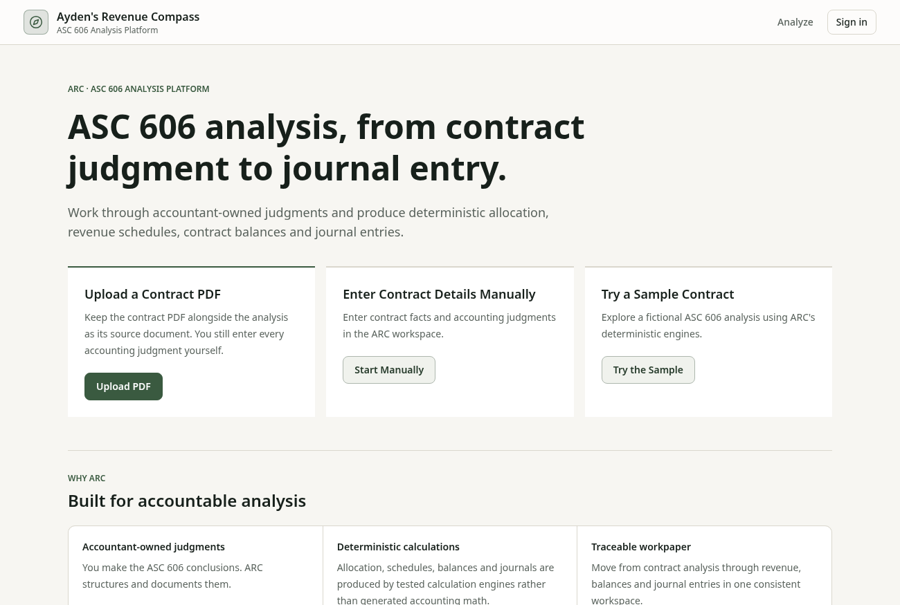
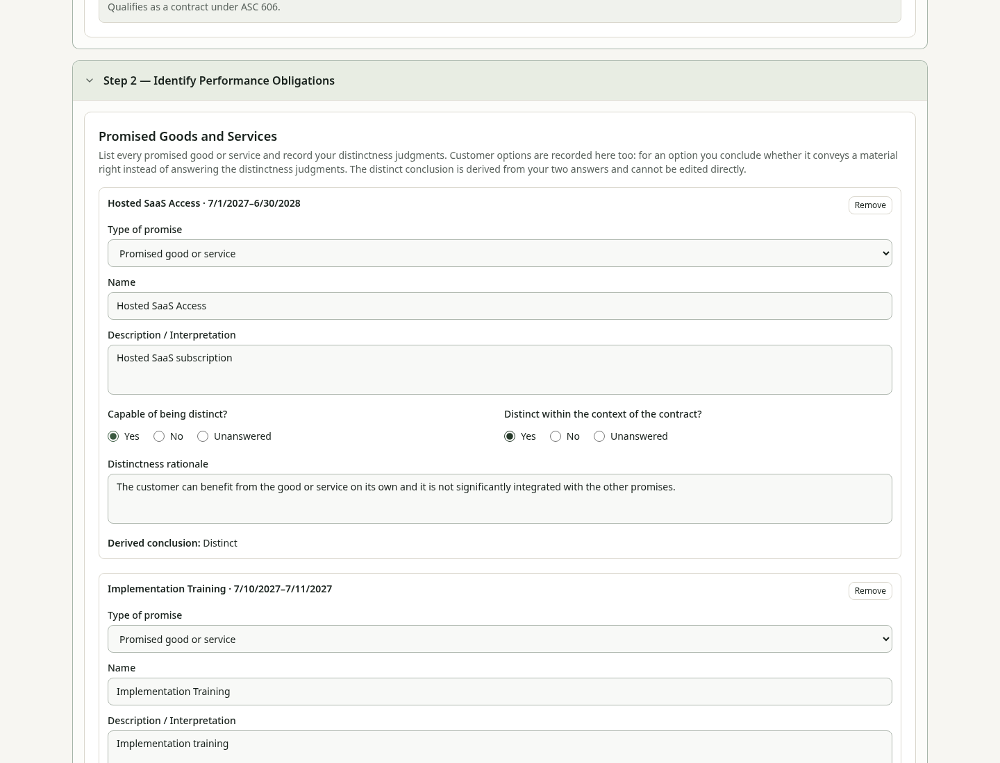
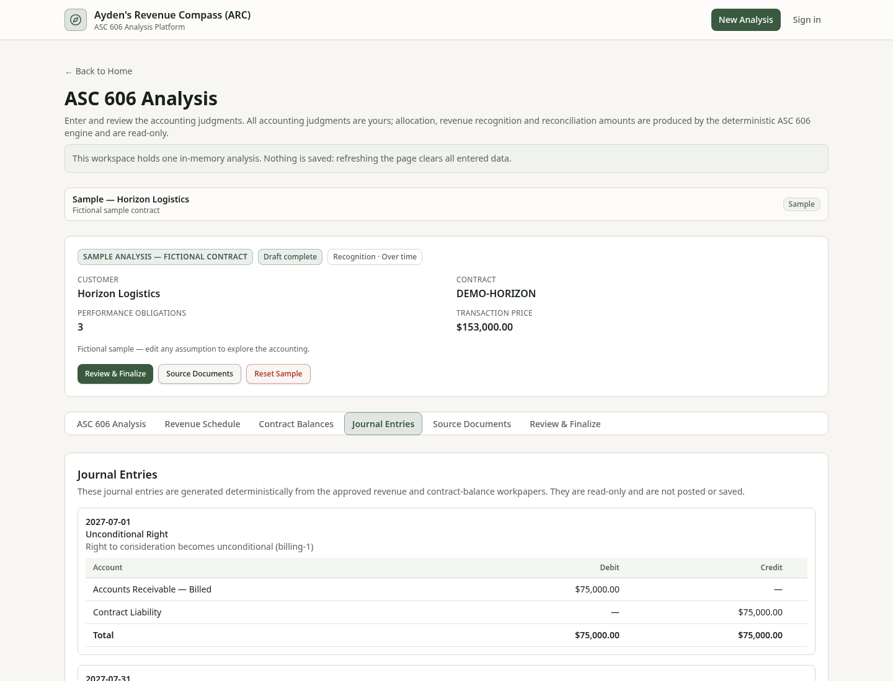
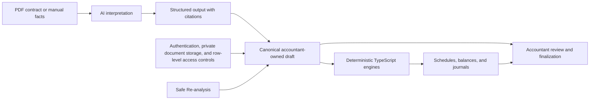

# ARC — Ayden’s Revenue Compass

**A portfolio-grade ASC 606 application that uses AI to interpret contracts, deterministic accounting engines to calculate the accounting, and accountant review controls to produce an auditable analysis.**

> **AI interprets. Deterministic TypeScript calculates. The accountant remains authoritative.**

## Why I Built ARC

I designed and built ARC as a portfolio project to demonstrate ASC 606 technical accounting expertise, accounting-systems design, deterministic calculation logic, and controlled use of AI.

The project reflects how I believe accounting automation should work: software can organize evidence, calculate repeatable outputs, and surface issues, but it should not obscure the judgments, controls, or audit trail that make the analysis reliable.

## What ARC Does

ARC turns a SaaS contract into a structured ASC 606 workpaper:

- accepts a PDF source document or manual contract entry;
- organizes the five-step ASC 606 analysis;
- separates contract facts from accountant-owned judgments;
- calculates allocation, revenue recognition, balances, and journal entries deterministically;
- links AI-assisted conclusions to source evidence;
- identifies reconciliation and workflow issues; and
- supports review and finalization of saved revisions.

## The Core Control Principle

ARC uses distinct responsibilities rather than treating AI as an accounting engine.

| Responsibility                                                    | Owner                                                    |
| ----------------------------------------------------------------- | -------------------------------------------------------- |
| Extract and interpret contract language                           | AI, subject to structured output and citation validation |
| Calculate allocation, recognition, balances, and journal entries  | Deterministic TypeScript engines                         |
| Approve judgments, resolve uncertainty, and finalize the analysis | Accountant                                               |

The AI boundary expressly excludes revenue schedules, allocation results, journal entries, and internal record identifiers. Those outputs are derived by tested application logic after the contract facts and judgments have been structured.

## 5-Minute Demo

1. From Home, choose **Try the Sample** to open the fictional **Horizon Logistics** contract.
2. Review the five-step analysis and the three performance obligations.
3. Inspect source-linked AI conclusions and the accountant review controls.
4. Open **Revenue Schedule** to see deterministic allocation and daily-to-monthly recognition results.
5. Open **Contract Balances** and **Journal Entries** to trace billing, collections, revenue, receivables, contract assets, and contract liabilities.
6. Finish in **Review & Finalize** to inspect validation, reconciliation, and finalization controls.

Horizon is intentionally synthetic. Its figures are designed to demonstrate the workflow without representing a real company or contract.

## Accounting Capabilities

ARC v1 includes curated workflows for:

- ASC 606 contract criteria and documented conclusions;
- promised goods and services, performance obligations, and distinctness judgments;
- fixed and variable consideration;
- relative standalone selling price allocation;
- point-in-time and ratable over-time revenue recognition, including partial months;
- billing events, cash collections, receivables, contract assets, and contract liabilities;
- monthly revenue schedules and contract-balance rollforwards;
- balanced illustrative journal entries;
- contract modifications and material-right workflows; and
- validation and reconciliation controls across the analysis.

## Architecture

I designed ARC so interpretation, calculation, review, and persistence remain separate control layers.

- **Contract input:** PDF source documents are stored separately from the structured analysis; manual entry remains available.
- **AI interpretation:** GPT-5.6 Terra produces versioned, structured proposals and cited evidence. It does not calculate accounting outputs.
- **Canonical workflow:** accepted facts and judgments enter an accountant-owned draft rather than becoming authoritative merely because the AI proposed them.
- **Accounting engines:** TypeScript modules calculate allocation, recognition, balances, journals, modifications, and related reconciliations.
- **Review and finalization:** unresolved review items and defined workflow warnings can block finalization without suppressing otherwise valid deterministic outputs.
- **Persistence and security:** Supabase provides PostgreSQL persistence, authentication, private PDF storage, and row-level access controls; server-only credentials remain outside the browser.

## AI Safety & Auditability

ARC is designed to fail safely when automation is uncertain.

- **Evidence-bound conclusions:** text citations resolve to bounded PDF anchors before an AI response is accepted.
- **Structured validation:** model output passes schema, reference-integrity, relationship, and citation checks before it can enter the workflow.
- **Explicit review:** AI conclusions can require accountant confirmation or resolution; provenance is not treated as approval.
- **No silent overwrite:** accountant-owned values and review decisions remain authoritative.
- **Safe Re-analysis:** same-source re-analysis must preserve canonical structural identity. Changed sources, unavailable prior analysis, ambiguous routing, or structural mutation are declined while the previous analysis is preserved.
- **Fail-closed controls:** invalid AI responses and unresolved finalization blockers do not become completed accounting conclusions.
- **Privacy boundary:** source-document text and prompts are not persisted in run metadata; source links are short-lived and opened only on request.

## Quality & Testing

The current repository passes **2,592 automated tests across 200 test files**. The verification workflow also includes:

- TypeScript type checking;
- ESLint and formatting enforcement;
- production builds;
- a client-bundle audit for privileged key material; and
- SQL suites covering row-level security, privileges, persistence, and concurrency behavior.

Accounting tests emphasize exact monetary reconciliation, date boundaries, allocation integrity, schedule totals, balanced journal entries, modification treatment, and failure behavior—not only rendered UI states.

## Technology

- **Application:** React 19, TypeScript, TanStack Start and TanStack Router
- **Interface:** Tailwind CSS and accessible component primitives
- **Persistence:** Supabase PostgreSQL, Auth and private Storage
- **AI:** OpenAI API with GPT-5.6 Terra, structured outputs and server-only credentials
- **Documents:** PDF.js-based source review and citation navigation
- **Verification:** Vitest, Testing Library, ESLint, TypeScript checks and SQL test suites

## Scope

ARC v1 is a portfolio application demonstrating curated ASC 606 workflows and accounting-control design. It is not a generalized commercial revenue subledger, does not claim to handle every contract pattern, and does not replace professional accounting judgment or authoritative accounting guidance.

All companies, contracts, and screenshots shown in this repository are fictional.
